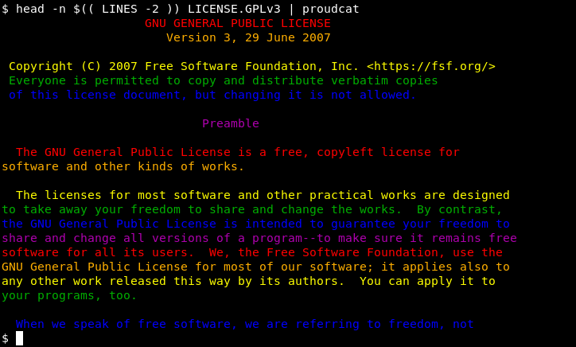

<!-- {{{1 -->

    File        : README.md
    Maintainer  : Felix C. Stegerman <flx@obfusk.net>
    Date        : 2020-06-22

    Copyright   : Copyright (C) 2020  Felix C. Stegerman
    Version     : v0.0.1
    License     : GPLv3+

<!-- }}}1 -->

[](https://www.gnu.org/licenses/gpl-3.0.html)

## Description

proudcat-rust - cat + :rainbow:

proudcat-rust is basically a variant of
[`proudcat`](https://github.com/obfusk/proudcat) /
[`pridecat`](https://github.com/lunasorcery/pridecat)
written in rust.



## Help

```bash
$ proudcat --help
```

## Installing

...

## License

[](https://www.gnu.org/licenses/gpl-3.0.html)

<!-- vim: set tw=70 sw=2 sts=2 et fdm=marker : -->
